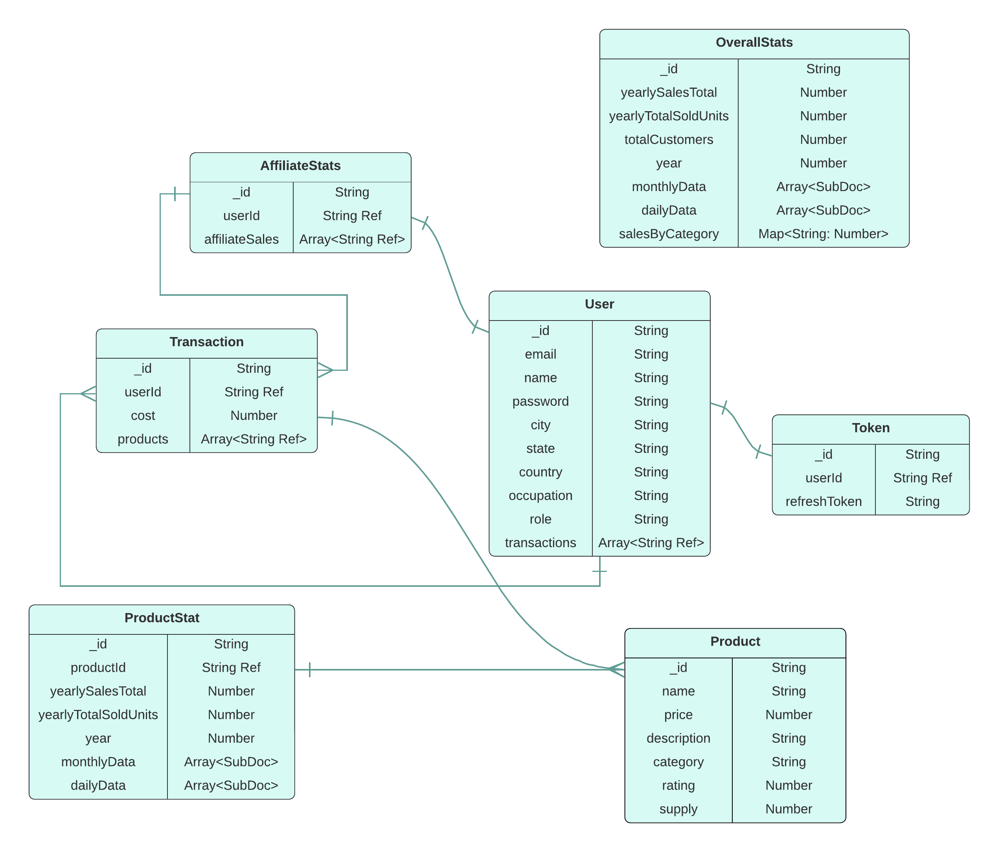
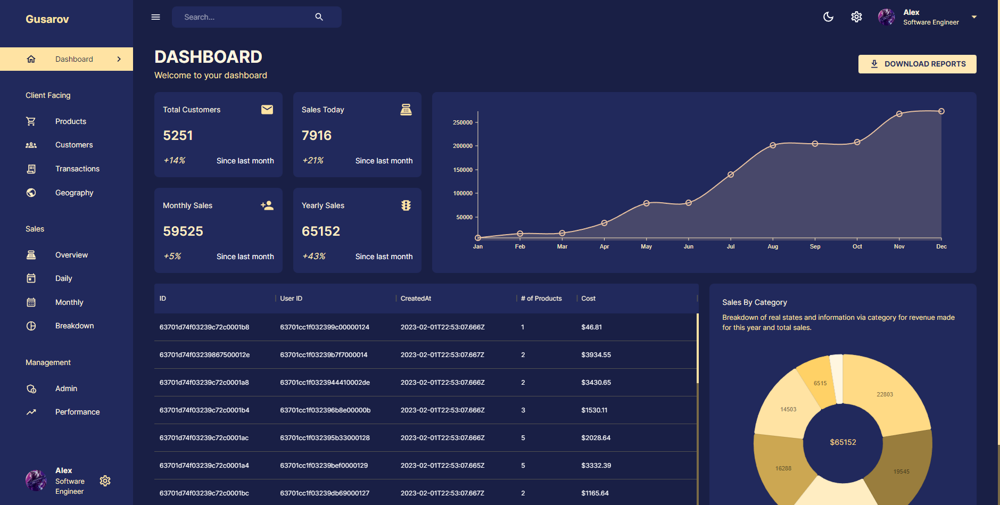
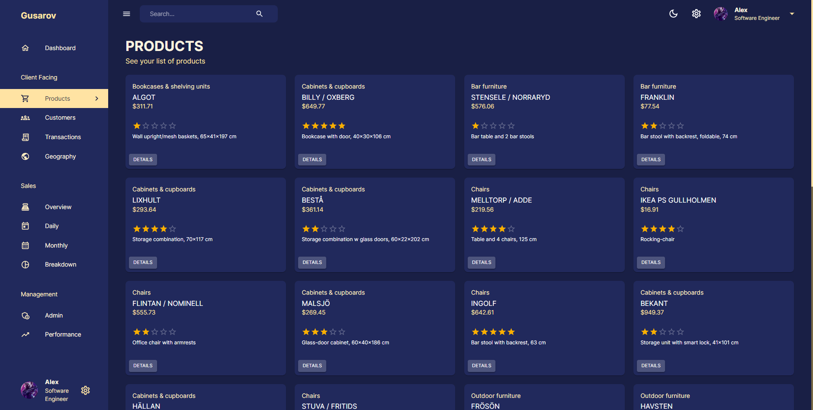
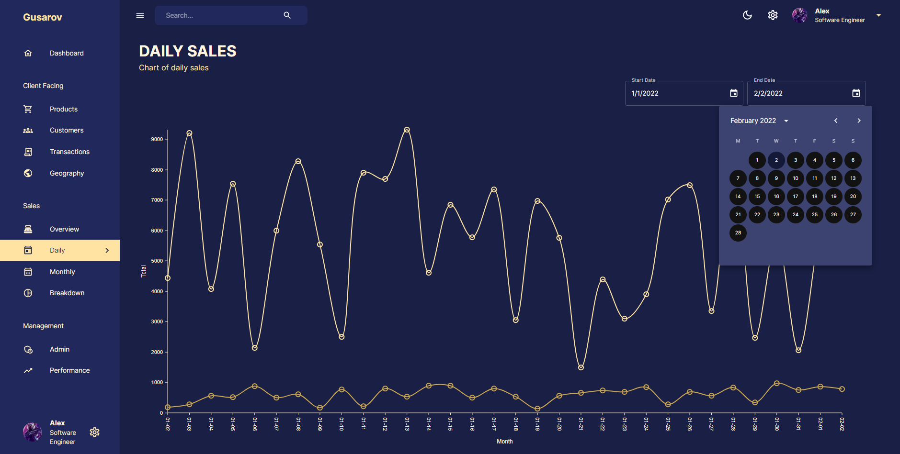
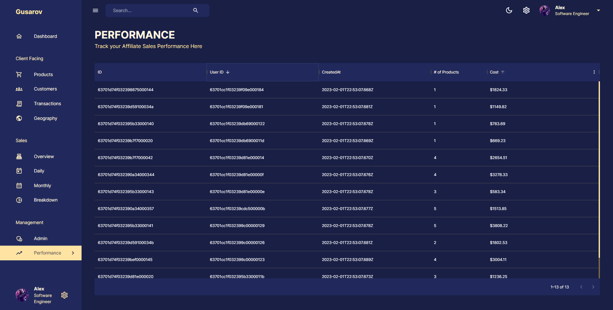

<h1><p align="center">🎩 FullStack Admin Dashboard App | MNRN</p></h1>

<div align="center">

Admin Dashboard, created based on the MNRN stack and using its own APIs

> 📝 [README RU](./README_RU.md)</p>

</div>

## 💻 Stack

<div align="center">


</div>

## ✍️ Description

### 🧾 This application includes the following pages::

-   **Dashboard** ( Basic information about sales, transactions )
-   **Client Facing**
    -   **Products** ( A list of products with the ability to view statistical information for each of them. )
    -   **Customers** ( A list of clients in a tabular format with the ability to sort and filter. )
    -   **Transactions** ( A list of transactions in tabular format. Sorting and pagination takes place in server-side mode )
    -   **Geography** ( View the geographical location of users. )
-   **Sales**
    -   **Overview** ( Overview of total revenues and profits )
    -   **Daily** ( Daily sales chart )
    -   **Monthly** ( Monthly sales chart )
    -   **Breakdown** ( Breakdown of sales by category )
-   **Management**
    -   **Admins** ( List of administrators )
    -   **Performance** ( Tracking the performance of your own affiliate sales )

## 📘 Data Model

<div align="center">



The source data is located at the path [/server/data](./server/data/). It is necessary to import data in json format. The file name corresponds to the name of the collection.

</div>

## 💻 Quick Start

> 🔖 **Optional**: Before you start, you can change the data in [/server/.env](./server/) and [/client/.env](./client/) to the ones you need.

### 1) Backend ( It is deployed using Docker Compose tools )

#### For development:

```bash
cd ./server/ && docker compose up dev
```

#### For production:

```bash
cd ./server/ && docker compose up -d prod
```

### 2) Импорт данных из [/server/data](./server/data/)

### 3) Frontend

#### For development:

```bash
cd ../client && npm run start
```

#### For production build:

```bash
cd ../client && npm run build
```

> P.S. The build directory containing the production build is created within the root project folder. You can also run the following command to serve the build version in a static server:

```bash
npm install -g serve && serve -s build
```

## 🖼️ Demo

-   <details open>
      <summary><h3>🖥️ Dashboard</h3></summary>
      <div align="center"> 
        
      </div>
    </details>

-   <details>
      <summary><h3>📦 Products</h3></summary>
      <div align="center"> 
        
      </div>
    </details>

-   <details>
      <summary><h3>👥 Customers</h3></summary>
      <div align="center"> 
        
      </div>
    </details>

-   <details>
      <summary><h3>💱 Transactions</h3></summary>
      <div align="center"> 
        
      </div>
    </details>

-   <details>
      <summary><h3>🌎 Geography</h3></summary>
      <div align="center"> 
        
      </div>
    </details>

-   <details>
      <summary><h3>💰 Overview</h3></summary>
      <div align="center"> 
        
      </div>
    </details>

-   <details>
      <summary><h3>📈 Daily</h3></summary>
      <div align="center"> 
        
      </div>
    </details>

-   <details>
      <summary><h3>📉 Monthly</h3></summary>
      <div align="center"> 
        
      </div>
    </details>

-   <details>
      <summary><h3>📊 Breakdown</h3></summary>
      <div align="center"> 
        
      </div>
    </details>

-   <details>
      <summary><h3>💼 Admins</h3></summary>
      <div align="center"> 
        
      </div>
    </details>

-   <details>
      <summary><h3>🏆 Performance</h3></summary>
      <div align="center"> 
        
      </div>
    </details>

## 📄 Credits

Made by [Gusarovv](https://github.com/gusarovv) with ❤️

The project can be used for any purpose.

Please give a ⭐️ if this project helped you!
