<h1><p align="center">🎩 FullStack Admin Dashboard App | MNRN</p></h1>

<div align="center">

Admin Dashboard, созданный на основе стека MNRN и использующий собственные API

> 📝 [README EN](./README.md)</p>

</div>

## 💻 Stack

<div align="center">


</div>

## ✍️ Description

### 🧾 Приложение включает в себя следующие страницы:

-   **Dashboard** ( Ключевые сведения по продажам, транзакциях )
-   **Client Facing**
    -   **Products** ( Список продуктов, с возможностью просмотра статистических сведений по каждому из них )
    -   **Customers** ( Список клиентов в табличном формате с возможностью сортировки и фильтрации )
    -   **Transactions** ( Список транзакций в табличном формате. Сортировка и пагинация происходит в server-side режиме )
    -   **Geography** ( Отображение географического положения пользователей )
-   **Sales**
    -   **Overview** ( Обзор общих доходов и прибыли )
    -   **Daily** ( График ежедневных продаж )
    -   **Monthly** ( График ежемесячных продаж )
    -   **Breakdown** ( Разбивка продаж по категориям )
-   **Management**
    -   **Admins** ( Список администраторов )
    -   **Performance** ( Отслеживание показателей собственных партнерских продаж )

## 📘 Data Model

<div align="center">

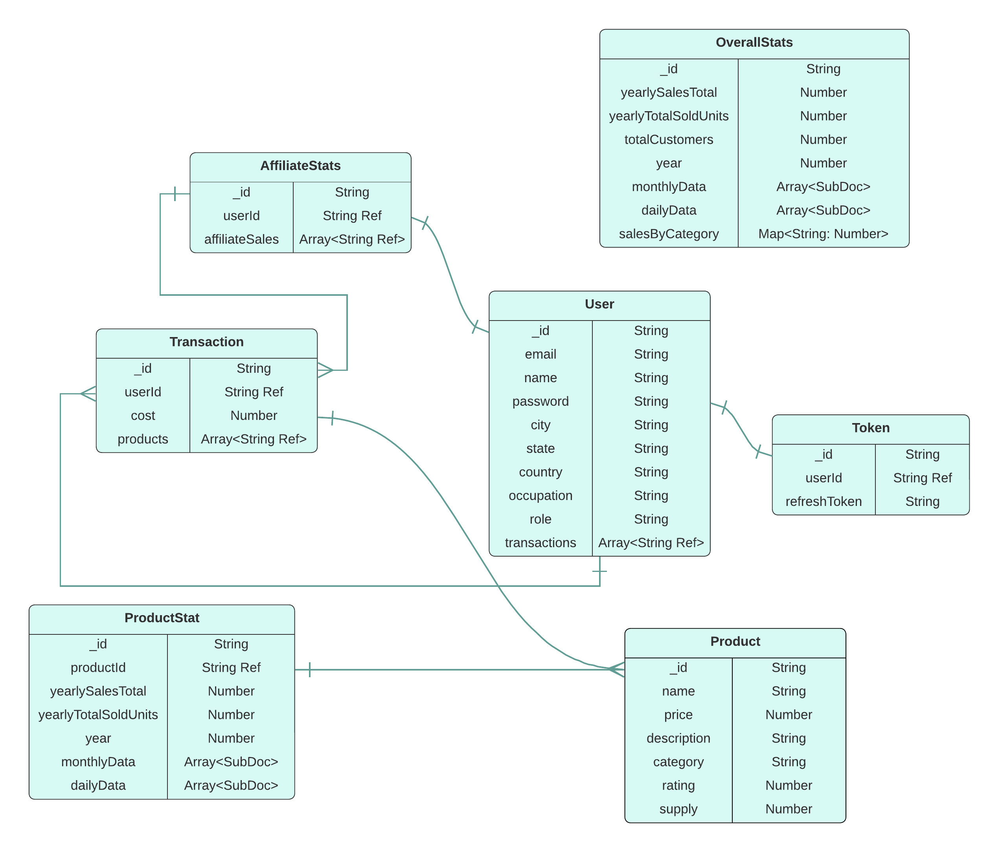

Исходные данные расположены по пути [/server/data](./server/data/). Импортировать необходимо данные, находящиеся в json формате. Название файла соответствует названию коллекции.

</div>

## 💻 Quick Start

> 🔖 **Необязательно**: Перед началом можно изменить тестовые данные в [/server/.env](./server/) и [/client/.env](./client/) на те, которые вам необходимы.

### 1) Backend ( Разворачивается при помощи средств Docker Compose )

#### For development:

```bash
cd ./server/ && docker compose up dev
```

#### For production:

```bash
cd ./server/ && docker compose up -d prod
```

### 2) Импорт данных из [/server/data](./server/data/)

### 3) Frontend

#### For development:

```bash
cd ../client && npm run start
```

#### For production build:

```bash
cd ../client && npm run build
```

> P.S. Build создается в корневой папке проекта. Вы также можете вызвать команду для запуска build-версии на сервере:

```bash
npm install -g serve && serve -s build
```

## 🖼️ Demo

-   <details open>
      <summary><h3>🖥️ Dashboard</h3></summary>
      <div align="center"> 
        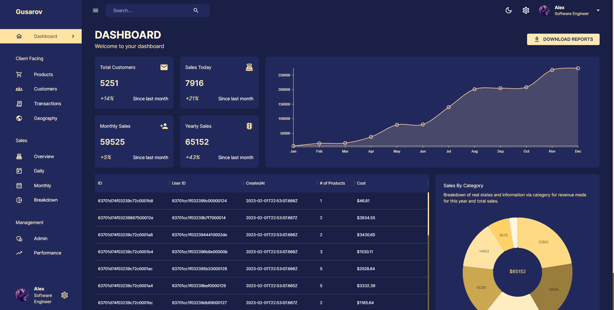
      </div>
    </details>

-   <details>
      <summary><h3>📦 Products</h3></summary>
      <div align="center"> 
        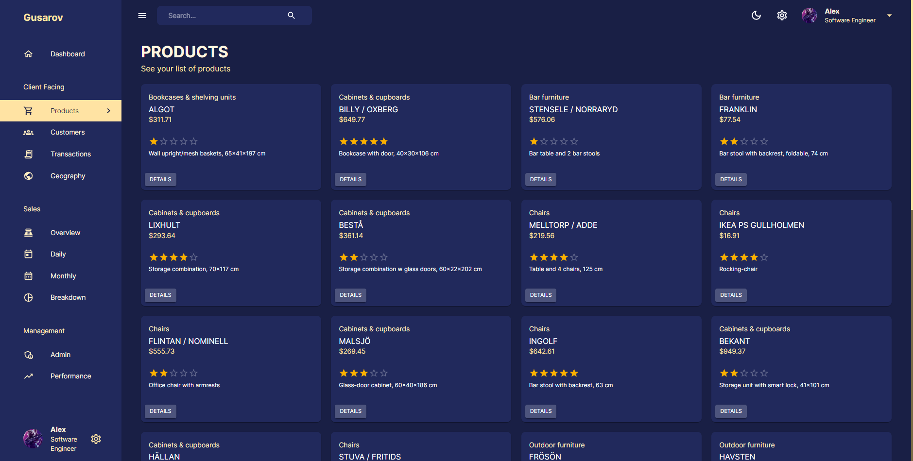
      </div>
    </details>

-   <details>
      <summary><h3>👥 Customers</h3></summary>
      <div align="center"> 
        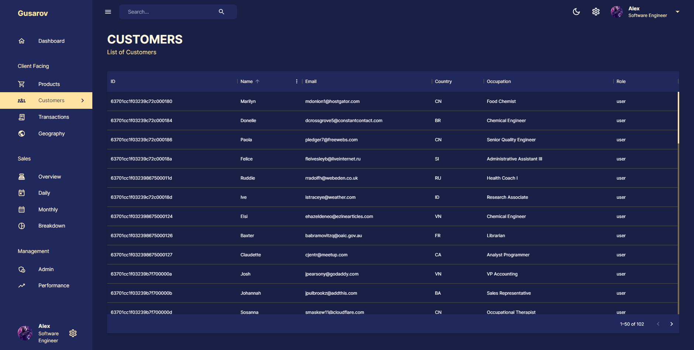
      </div>
    </details>

-   <details>
      <summary><h3>💱 Transactions</h3></summary>
      <div align="center"> 
        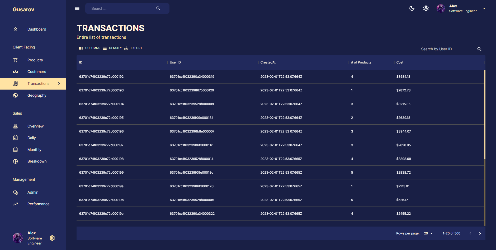
      </div>
    </details>

-   <details>
      <summary><h3>🌎 Geography</h3></summary>
      <div align="center"> 
        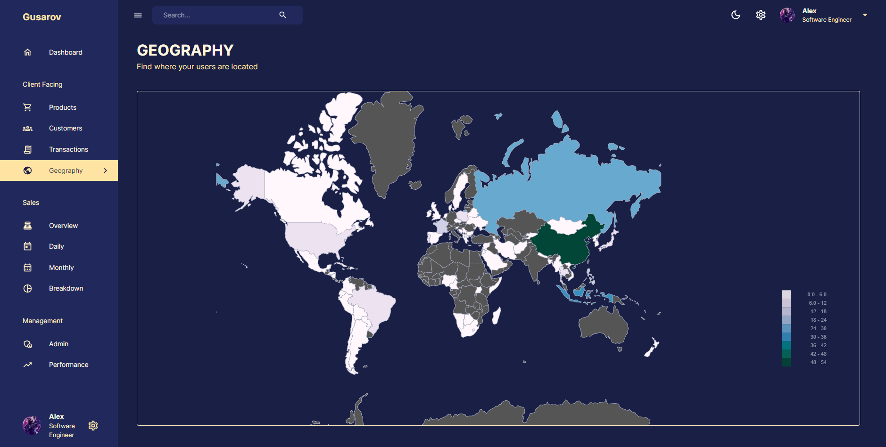
      </div>
    </details>

-   <details>
      <summary><h3>💰 Overview</h3></summary>
      <div align="center"> 
        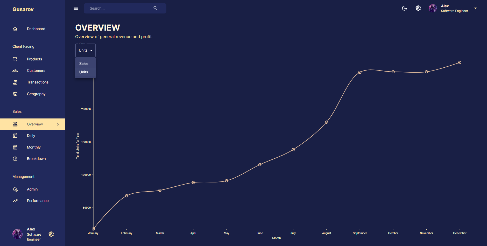
      </div>
    </details>

-   <details>
      <summary><h3>📈 Daily</h3></summary>
      <div align="center"> 
        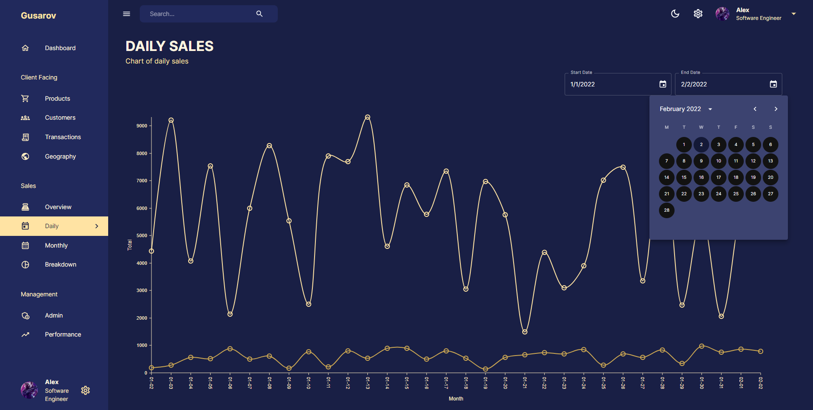
      </div>
    </details>

-   <details>
      <summary><h3>📉 Monthly</h3></summary>
      <div align="center"> 
        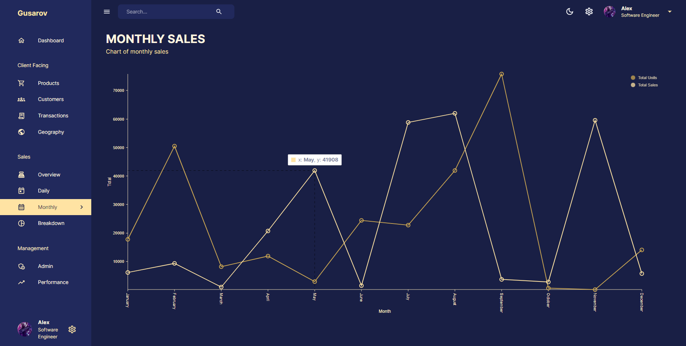
      </div>
    </details>

-   <details>
      <summary><h3>📊 Breakdown</h3></summary>
      <div align="center"> 
        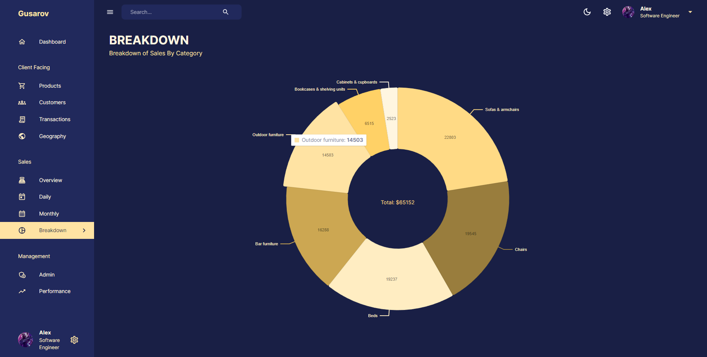
      </div>
    </details>

-   <details>
      <summary><h3>💼 Admins</h3></summary>
      <div align="center"> 
        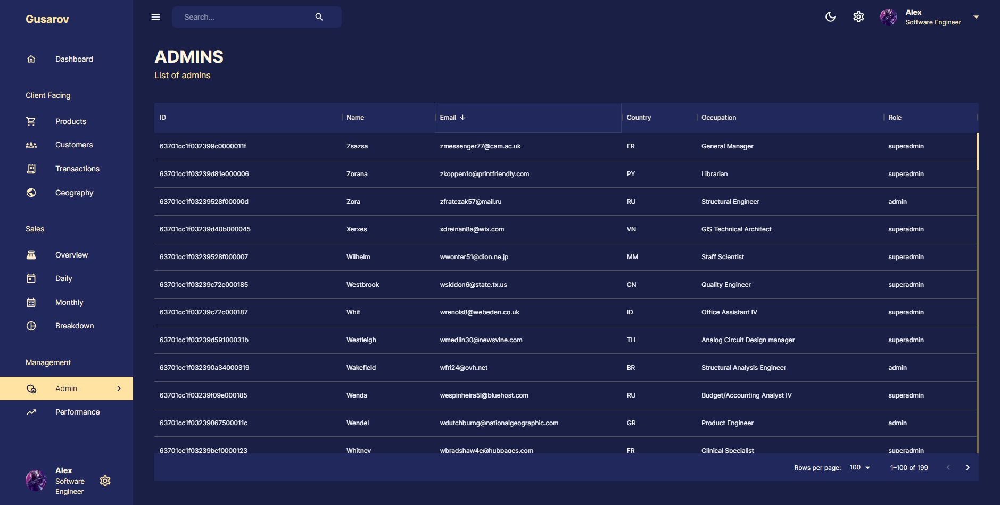
      </div>
    </details>

-   <details>
      <summary><h3>🏆 Performance</h3></summary>
      <div align="center"> 
        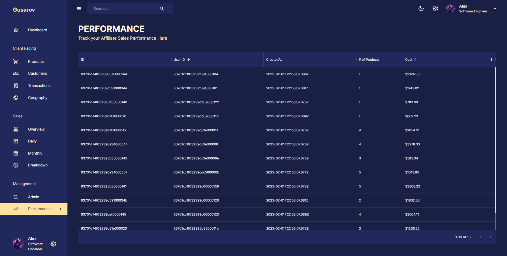
      </div>
    </details>

## 📄 Credits

Автор [Gusarovv](https://github.com/gusarovv) | Сделано с ❤️

Проект может быть использован для любых целей.

Пожалуйста, поставьте ⭐️ , если этот проект помог вам!
